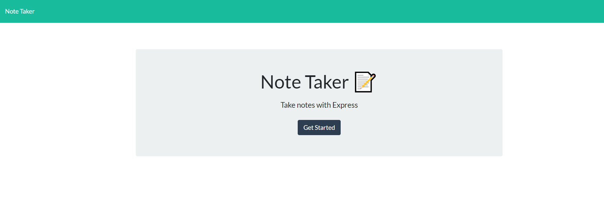
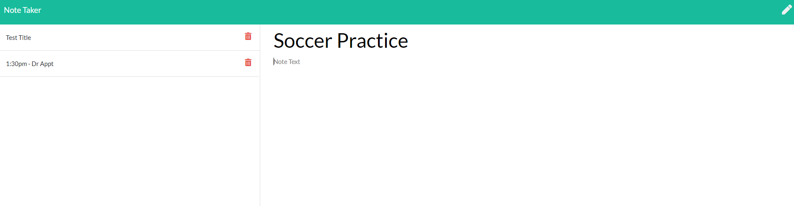

# Note Taker App

## Description

For users that need to keep track of a lot of information, it's easy to forget or be unable to recall something important. 
This application allows the user to write, save, and delete notes. The app uses an express backend and saves & retrieves note data from a JSON file. 

Deployed application: [https://intense-meadow-88018.herokuapp.com/](https://intense-meadow-88018.herokuapp.com/)

## Screenshots

## Table of Contents
  * [Usage](#usage)
  * [Licensing](#licensing)
  * [Contributors](#contributors)
 
  * [Questions](#questions)

## Usage
  To run application, visit the deployed link: [https://intense-meadow-88018.herokuapp.com/](https://intense-meadow-88018.herokuapp.com/)

## Licensing
MIT
https://opensource.org/licenses/MIT

## Contributors
https://github.com/ARBarber0510

## Questions
Please visit [ARBarber0510](https://github.com/ARBarber0510) for more information.
Any additional questions may be sent to [arbarber.ab@gmail.com](arbarber.ab@gmail.com)

